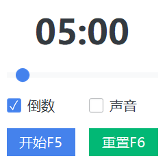

## Stopwatch

*计时器*

### 用法

* 双击 **start.bat** 启动程序

### 说明

* 支持1-60分钟顺序计时、倒计时
* 最后10秒强调效果（文字变红，播放声音）
* 支持窗口置顶、设置选项自动隐藏
* F5：开始/暂停
* F6：复位
* ESC/Alt+F4：退出（窗口获得焦点时才能退出，避免误操作）

### 截图

* 计时界面

* 设置界面
